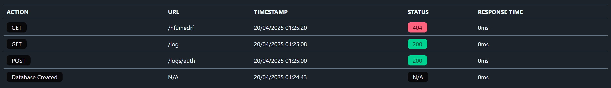

# Logger Middleware for GoFiber

Logger is a Go package that extends the [GoFiber](https://gofiber.io/) framework by providing a middleware to log every API call into a SQLite database. Additionally, it includes a web-based visualizer to browse and analyze the logs.

## Features

- **Automatic Logging**: Logs every API request to a SQLite database, capturing details like IP address, URL, method, response status, latency, and more.
- **Web Visualizer**: A built-in web interface for browsing and filtering logs.
- **Highly Configurable**: Options to exclude specific routes or requests, secure log access with passwords, and customize storage paths.
- **Optional Visualizer**: Use only the logging feature without enabling the web visualizer if desired.
- **Easy Integration**: Seamlessly integrates with GoFiber applications.

---

## Installation

To use Logger in your GoFiber project, add it to your dependencies:

```bash
go get github.com/ZiplEix/logger
```

---

## Usage

### Basic Example

Here’s an example of how to use Logger in your GoFiber application:

```go
package main

import (
	"github.com/ZiplEix/logger"
	"github.com/gofiber/fiber/v2"
)

func main() {
	app := fiber.New()

	// Add the middleware
	app.Use(logger.New())

	// Example routes
	app.Get("/", func(c *fiber.Ctx) error {
		return c.SendString("Hello, World!")
	})

	app.Get("/log", func(c *fiber.Ctx) error {
		logs, err := logger.GetAllLogs()
		if err != nil {
			return c.SendString("Error retrieving logs: " + err.Error())
		}
		return c.JSON(logs)
	})

	// Set up the logger with default configuration
	// This is optional if you only want to log requests without the web visualizer.
	logger.Setup(app, logger.Config{})

	// Start the server
	app.Listen(":8080")
}
```

### Important Notes

1. **Middleware Declaration Order**: 
   In GoFiber, the order of middleware declaration matters. Any routes declared **before** the logging middleware (`logger.New()`) will not be logged. Ensure you declare the middleware early in your application setup.

2. **Optional Visualizer**: 
   If you only want to log requests to the database and do not need the web visualizer, you can skip calling `Setup(app, config)`. The middleware will still capture and store all logs in the SQLite database.

---

## Configuration

The `Config` struct allows you to customize the Logger middleware. Here are the main configuration options:

```go
type Config struct {
    DatabasePath         string   // Path for SQLite database (default: "./logs.sqlite")
    WorkerBufferSize     int      // Buffer size for log workers (default: 100)
    Path                 string   // Base path for logs view (default: "/logs")
    ExcludeRoutes        []string // Routes to exclude (default: ["/logs", "/favicon.ico"])
    ExcludePatterns      []string // Patterns to exclude (default: ["/logs/*"])
    SecureByPassword     *bool    // Secure logs view with password (default: true)
    Password             string   // Password for logs view (default: "password")
    JwtSecret            string   // Secret key for JWT tokens (default: "secret")
    JwtExpireTime        int64    // JWT token expiration time in seconds (default: 3600)
    Theme                string   // Theme for logs view (default: "dark")
}
```

Example of custom configuration:

```go
logger.Setup(app, logger.Config{
    DatabasePath: "./custom_logs.sqlite",
    Path:         "/admin/logs",
    Password:     "mysecurepassword",
    Theme:        "light",
})
```

---

## Web Visualizer

The Logger package includes a web-based visualizer to browse logs. By default, the visualizer is available at `/logs`. If secured with a password (default: "password"), you will be prompted to log in.



### Endpoints Added by `Setup`

Calling `logger.Setup` on your application adds the following four endpoints:

1. **`GET /logs`**: Displays the logs web interface.
2. **`GET /logs/all`**: Fetches all logs in JSON format.
3. **`GET /logs/auth`**: Displays the login page for accessing the logs.
4. **`POST /logs/auth`**: Handles user authentication for secured access.

If you do not need these endpoints or the visualizer, you can skip calling `Setup`.

---

## Log Entry Structure

Logs are stored in a SQLite database in the following structure:

| Field       | Type     | Description                                       |
|-------------|----------|---------------------------------------------------|
| ID          | int64    | Unique log ID                                     |
| IPAddress   | string   | IP address of the requester                       |
| Url         | string   | URL of the request                                |
| Action      | string   | HTTP method (GET, POST, etc.)                     |
| Details     | string   | Additional details about the request (optional)   |
| Timestamp   | datetime | Time the request was made                         |
| UserAgent   | string   | User-Agent header of the requester (optional)     |
| Status      | string   | HTTP response status                              |
| Latency     | int64    | Request processing time in milliseconds           |

---

## Contributing

Contributions are welcome! Feel free to open issues or submit pull requests to improve this project.

---

## Author

Made with ❤️ by [ZiplEix](https://github.com/ZiplEix)
